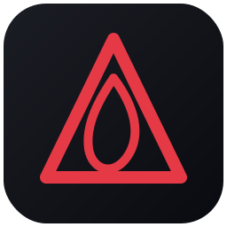
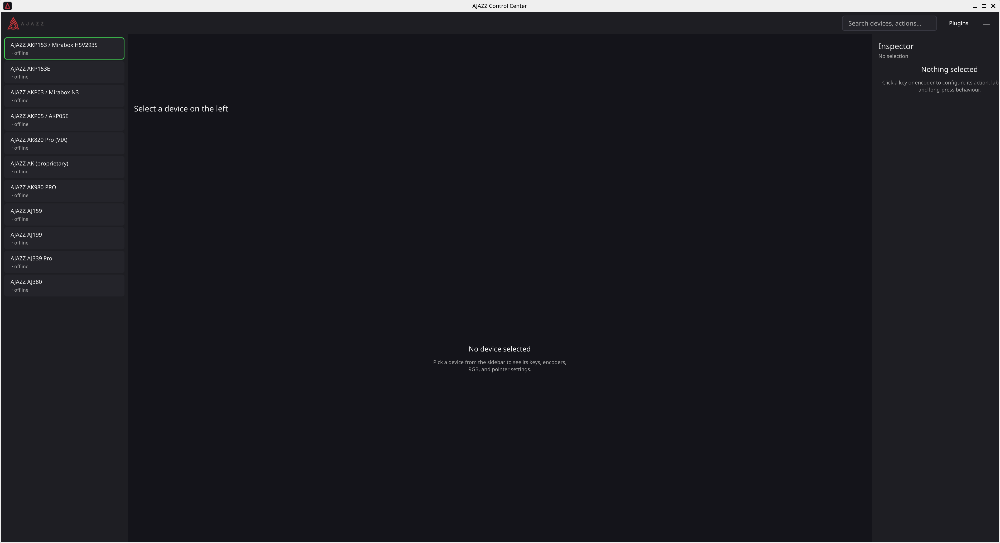
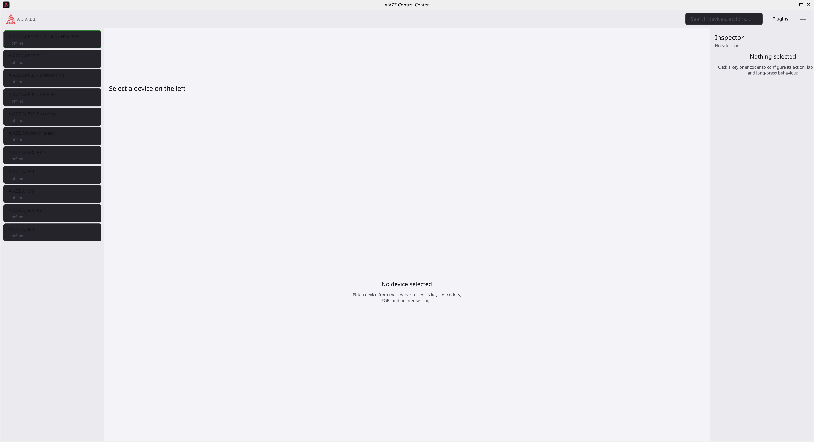

  

# AJAZZ Control Center Wiki

Welcome to the **AJAZZ Control Center** wiki — the community home for
cross-platform configuration of AJAZZ stream decks, keyboards and mice on
Linux, Windows and macOS.

AJAZZ Control Center (`acc`) is a Qt 6 / C++20 desktop application with an
embedded Python plugin runtime. It is an independent, clean-room project
and is not affiliated with, endorsed by, or supported by AJAZZ.

<!-- BEGIN AUTOGEN: stats -->
**11 devices** across 3 keyboard, 4 mouse, 4 streamdeck — 9 functional, 2 scaffolded.
<!-- END AUTOGEN: stats -->

## Screenshots

Material Design QML UI with a `ThemeService`-backed light / dark switch
(Settings → Appearance). Both modes are first-class — pick whichever
matches your desktop.

  
   
  <em>Dark mode (default — `Appearance/Mode = auto` resolves to dark on dark desktops)</em>

  
   
  <em>Light mode (Settings → Appearance → Light)</em>

## Quick links

<!-- BEGIN AUTOGEN: toc-wiki -->
- [Building](Building)
- [Documentation Style](Documentation-Style)
- [FAQ](FAQ)
- [Plugin Development](Plugin-Development)
- [Quick Start](Quick-Start)
- [Release Process](Release-Process)
- [Reverse Engineering](Reverse-Engineering)
- [Supported Devices](Supported-Devices)
- [Troubleshooting](Troubleshooting)
<!-- END AUTOGEN: toc-wiki -->

## Project goals

1. **One app, every AJAZZ device.** Stream decks (AKP153/AKP03/AKP05),
   keyboards (VIA-compatible + proprietary) and AJ-series mice, all in a
   single Qt application.
1. **Every function, every platform.** Displays, RGB, encoders, dials,
   macros, per-app profiles, DPI curves, firmware reporting — on Linux,
   Windows and macOS.
1. **Scriptable.** A first-class Python plugin SDK so the community can
   ship actions faster than any vendor tool.
1. **Transparent.** Clean-room protocols, public captures, reproducible
   builds, signed release artifacts.

## Status

- Alpha — protocols are being mapped and stabilized. Profiles created in
  pre-1.0 releases may need to be re-exported.
- Stable channel will begin at **v1.0** once at least one device per
  family has full feature parity with the vendor tool.

## Contributing

See [CONTRIBUTING.md](https://github.com/Aiacos/ajazz-control-center/blob/main/CONTRIBUTING.md).
New device captures are the single most valuable contribution — open a
[Device Request](https://github.com/Aiacos/ajazz-control-center/issues/new?template=device_request.yml)
issue to start.

## License

GPL-3.0-or-later. See [LICENSE](https://github.com/Aiacos/ajazz-control-center/blob/main/LICENSE).
